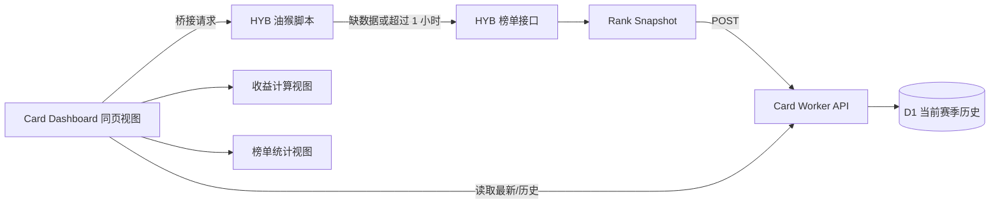

# HYB Card Dashboard 榜单统计设计

**日期：** 2026-08-05  
**状态：** 已确认，等待实现计划

## 目标

在现有 HYB Card Dashboard 中增加一个同地址的“榜单统计”二级视图，使用与 HYB Farm Dashboard 相同的 Cloudflare Worker + 静态 Assets + D1 + 油猴脚本桥接架构，长期保存当前赛季的全服榜单历史，并计算用户的排名变化、入榜/出榜记录和估算传说概率。

## 已确认范围

- 页面地址保持 `https://card.gudong226.com/` 不变。
- 顶栏在 Farm Dashboard 历史记录按钮所在区域增加“榜单统计”入口。
- 点击入口后在同一页面切换到榜单统计视图，不使用新的路径、查询参数或 hash。
- 榜单数据是全服共享数据，写入 D1，所有访问者读取同一份历史。
- 当前只保存当前赛季；表结构保留 `season_id`，以后再扩展赛季切换。
- 服务器榜单约每小时刷新一次；页面无数据或快照超过 1 小时时，才触发一次主动抓取。
- 油猴脚本主动请求 HYB 榜单接口，页面不重复轮询 HYB 接口。
- 首版显示三个榜单：欧皇榜、消费榜、兑换榜。
- 每个榜单支持今日、本周、本月、赛季四个周期。
- `epic_today/week/month/total` 作为传说产出榜数据。
- `spend_today/week/month/total` 作为消费榜数据。
- `sets_today/week/month/total` 作为兑换套数榜数据。
- 概率为估算值，不冒充服务器真实抽卡概率。

## 架构



### Worker 与静态资源

当前仅负责静态 Assets 的 Worker 迁移为 Farm Dashboard 同类 Worker：

- 静态前端继续由 `web`/`site` Assets 提供。
- Worker 处理 `/api/rankings/*` 请求。
- D1 绑定使用独立的卡牌榜单数据库，不与 Farm 的价格表混用。
- 前端计算视图和榜单统计视图共用顶栏、主题和基础组件。

### 油猴脚本桥接

脚本同时匹配 HYB 榜单来源页面和 Card Dashboard 页面：

1. 页面调用 `GET /api/rankings/latest`。
2. 如果没有快照或 `capturedAt` 距今达到 1 小时，页面发送带 requestId 的 bridge message。
3. 脚本调用 `/api/cards/leaderboard?scope=global`，只发起一次请求。
4. 脚本将完整接口响应回传给页面。
5. 页面提交规范化快照到 `POST /api/rankings/snapshots`。
6. Worker 校验赛季、榜单键、数值和时间，并按小时桶与签名去重后写入 D1。

若未安装脚本，页面显示“需要安装同步脚本”；若请求失败，保留上一次 D1 数据并显示错误和最后更新时间。

## D1 数据模型

### `rank_snapshots`

保存每次被接受的榜单快照。

| 字段 | 类型 | 说明 |
|---|---|---|
| `id` | INTEGER PRIMARY KEY | 快照 ID |
| `season_id` | TEXT | HYB 赛季 ID |
| `season_name` | TEXT | 赛季名称 |
| `scope` | TEXT | 榜单范围，当前为 `global` |
| `captured_at` | INTEGER | HYB 返回的抓取时间，毫秒时间戳 |
| `captured_bucket` | INTEGER | 按 1 小时划分的时间桶 |
| `source` | TEXT | userscript 或其他来源 |
| `signature` | TEXT | 规范化榜单签名，用于重复检测 |
| `raw_json` | TEXT | 原始接口扩展信息 |
| `created_at` | INTEGER | Worker 写入时间 |

唯一约束：`season_id + scope + captured_bucket`。同一小时重复上传时返回已有快照，不产生重复历史。

### `rank_entries`

保存快照内每个榜单的用户行。

| 字段 | 类型 | 说明 |
|---|---|---|
| `snapshot_id` | INTEGER | 关联 `rank_snapshots.id` |
| `board_key` | TEXT | `epic_today` 等榜单键 |
| `user_id` | TEXT | 稳定用户 ID |
| `user_name` | TEXT | 当前显示名 |
| `avatar_url` | TEXT | 头像地址 |
| `value` | INTEGER | 榜单数值 |
| `rank` | INTEGER | 当前排名 |
| `is_vip` | INTEGER | 0/1 |
| `active_name_decoration` | TEXT | 当前装饰 |
| `name_display_preference` | TEXT | 显示偏好 |
| `raw_json` | TEXT | 用户行扩展字段 |

主键：`snapshot_id + board_key + user_id`。  
索引：`board_key + snapshot_id`、`user_id + board_key + snapshot_id`、`value`。

用户掉出前 100 后不删除旧行，因此可以查询完整的已观测历史。

## Worker API

### `GET /api/rankings/latest`

返回当前赛季最新快照时间、数据新鲜度、可用榜单和当前赛季信息。

### `GET /api/rankings/leaderboard`

参数：

- `board`: `epic`、`spend` 或 `sets`。
- `period`: `today`、`week`、`month` 或 `total`。
- `limit`: 默认 100，最大 100。

返回当前榜单行、上一快照中的对应行、数值变化、排名变化和快照时间。

### `GET /api/rankings/history`

参数：`userId`、可选 `board`。返回用户在当前赛季所有已观测快照中的榜单值、排名、消费、传说产出和 VIP 状态。

### `GET /api/rankings/users`

参数：`query`，按用户 ID 或用户名进行前缀/包含匹配，最多返回 20 个当前赛季已观测用户。返回用户 ID、最近用户名、头像和最近一次出现时间，供榜单搜索后调用 `history`。

### `GET /api/rankings/events`

对相邻快照进行比较，返回用户入榜、出榜、重新入榜、排名跃升和数值变化事件。

### `POST /api/rankings/snapshots`

接收油猴脚本回传的规范化快照。Worker 验证：

- 赛季 ID 和 scope 存在；
- 榜单键属于已知集合；
- 每个榜单最多 100 行；
- 用户 ID、排名和数值类型正确；
- 抓取时间不能明显晚于服务器当前时间；
- 同小时快照按签名去重。

## 榜单统计视图

采用“榜单优先”布局：

1. 顶部显示数据来源、当前赛季、最后更新时间和刷新状态。
2. 第一组切换为“欧皇榜 / 消费榜 / 兑换榜”。
3. 第二组切换为“今日 / 本周 / 本月 / 赛季”。
4. 统计卡显示当前总量、较上次新增/减少、入榜人数、出榜人数和平均估算概率。
5. 主表显示排名、头像、用户名、VIP、当前值、较上次变化和估算传说概率。
6. 点击用户行展开详情面板：赛季历史曲线、排名变化、入榜/出榜事件、传说产出和消费。
7. 榜单表支持搜索用户；用户即使已掉出当前前 100，仍可以从 D1 历史中查到。

## 概率计算

榜单页使用赛季累计榜单值计算估算概率，与当前查看的周期无关：

```text
estimatedPulls = spend_total / 10 + elapsedDays * (isVip ? 50 : 30)
estimatedLegendProbability = epic_total / estimatedPulls
```

- `elapsedDays` 按当前赛季北京时间凌晨 4 点计算，并限制在赛季范围内。
- 页面显示百分比并标注“估算”。
- `estimatedPulls <= 0` 时显示 `—`。
- 兑换榜行也显示同一用户的赛季估算概率；没有对应用户累计值时显示 `—`。

## 错误与刷新状态

- D1 有新鲜快照：直接展示，不请求 HYB。
- D1 无数据或超过 1 小时：触发 userscript bridge。
- 已有其他用户刚写入新快照：页面重新读取 D1，不重复写入。
- 脚本未安装、未登录或请求失败：显示安装/登录提示，保留旧数据。
- Worker 拒绝快照：前端显示拒绝原因，不清空已有历史。

## 非目标

- 不修改收益计算公式和当前收益计算视图。
- 不改变页面地址，不新增独立榜单 URL。
- 不把排行榜数据写入浏览器 IndexedDB 作为主存储。
- 不把当前榜单快照限制为“只保留最新前 100”；每次抓取出现过的用户都保留历史。
- 不把估算概率描述为服务器真实抽卡概率。

## 验收标准

- 顶栏按钮位于 Farm Dashboard 历史记录按钮所在区域，点击后地址栏不变。
- 三个榜单和四个周期均能切换并读取 D1 数据。
- 没有快照或快照超过一小时时，页面只触发一次桥接请求。
- 同一小时重复抓取不会产生重复快照。
- 用户掉出榜单后仍能在搜索和历史详情中查询。
- 用户详情能显示排名变化、入榜/出榜事件和估算传说概率。
- `npm run build` 成功，Worker API 和静态前端可以通过 Wrangler 本地验证。
